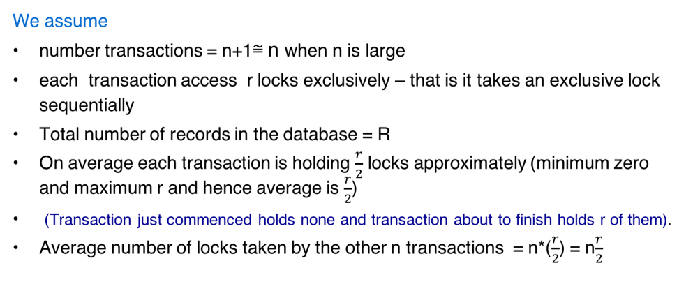

# Week 4

 

###  ACID

**Atomicity**: **all or nothing**. When apply for transaction, all of them are done or not at all. 

**Consistency**: the most difficult; If transaction is parallel, Preserving an Invariant. Any data written to the database must be **valid** according to all defined rules.

The transaction is a correct transformation of the state. Actions taken as a whole do not violate the integrity of the application state assuming transactions are correct programs.

**Isolation**: **executed sequentially**. every transactions have to wait until last transaction finish modifying. ->locking protocol -> sequential 

Even when several transactions are executed simultaneously, it appears to each transaction T that others executed either happen before T or after  T but not at the same time.

**Durability**: the system should **tolerate system failures** and any committed updates should not be lost. either entire block is written correctly on disk or the contexts of the block is unchanged. -> use version number and write sequentially. (Atomic disk write)

The durability property ensures that **once a transaction has been committed, it will remain** so, even in the event of power loss, crashes, or errors. 

 

### Atomic Disk Writes

entire block is written correctly on disk or the content of the block is unchanged. 

 

### Logged write:

similar to the duplex write

 

 

### CRC: Cyclic Redundancy Check

 

Good to check changes

do XOR

Shifting by bit

get reminder

The reminder is called CRC

Then do it again

if everything is correct

you will get a 0 reminder

The reminder will tell which bit goes wrong

 reliable

 

 

## Transaction models

Foreign key: this attribute is a key for another table.

### Flat

Do everything or not at all. 

Can be a very long running transaction. Any failure of transaction requires lot of unnecessary.

Do everything or not at all (if meet requirement, commit, otherwise, roll back)

(先做了再说)

**Good**: ACID; easy to implement; simple; no need hardware support

**limitation**: not convenient; not good for large scale; may keep rollback; 

 

### Flat with save points

Has lots of save points

Can rollback to particular point.

 

### Nested

divide transaction into hierarchic

Commit rule: 

* A subtransaction can either commit or abort, however, commit cannot take place unless the parent (and patent's parents) itself commits.
* Subtransactions have  A, C, and I properties but **not have D** property unless all its ancestors commit.
* Commit of a sub transaction makes its results available only to its parents.

Roll back Rules

* If a subtransaction rolls back all its children are forced to roll back.

Visibility Rules

* Changes made by a sub transaction are visible to the parent only when the sub transaction commits. Whereas all objects of **parent are visible to its children**. Implication of this is that the parent should not modify objects while children are accessing  them. This is not a problem as parent is not run in parallel with its children.

 

**Good**: can rollback a specific subtransaction, no need to rollback the whole transaction.  

**limitation**: No D; 

 

### TP monitor

Batch Processing

Time-sharing

Real-Time processing

Client-Server Processing 

Presentation service : defines interface between the application and the devices it has to interact to.  

Queue management

 

### Dekker's algorithm

C1，C2，turn

 

### Spinlock 自旋锁

Atomic

Lock two CPU cycle, one for reading, one for writing. **Reading and writing cannot be interpreted**. Use busy waiting.

a **spinlock** is a lock which causes a thread trying to acquire it to simply wait in a loop ("spin") while repeatedly checking if the lock is available

Not suitable for single CPU system.

 

### Dead lock

Each one waiting for others. 

System look prefect

have loop(s)

**Solution**

* Have enough resources
* Do not let a process simply rollback. -> makes live looks worse than deadlocks. -> everything seems working.
* Resource level: Linearly order the resources and request of resources should follow order. J > I 
* Pre-declare all resources in a single request -> only request once;
* wait and rollback
* Check resource dependency graph for cycles. ->  no hierarchies -> kill cycles (transactions)
* Use time out for global deadlock (for distribute database systems)
* Phantom Deadlock

**Calculate the probability of a deadlock**

 

 

 

---

END