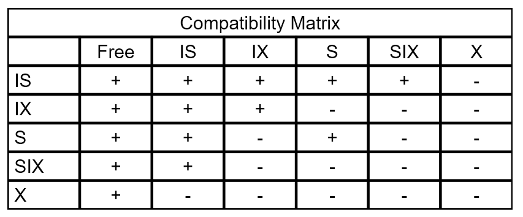

# Week 6

Something about presentation...

----

LectureSet5

---

Phantoms and Predicate locks:

When doing query, system will generate shared lock to satisfied tuples. When generate locks, there might have new transaction to insert some values.

Use predicate locks and page locks can solve this problem

### Predicate locks  谓词锁

Read and write sets can be defined by predicates (e.g. Where clauses in SQL statements) and associate a lock with such a set.

**problems**

### Granularity Locks  粒度锁

#### Intention Lock  意向锁

IS, IX, S, SIX, X

 

### Convoy

Long chain of waiting things.

FIFO can cause the problem of long queues. 

High priority transaction will wait pervious low priority transaction. 

### Optimistic Locking

Only need to take the lock when need it.

Lock as short as possible -> minimum locking

before commit (processing data), check value (version) at first

### Crabbing

Link list

Tree search

Steps:

Take the Xlock for entire list, do operation and release the list.

Start from lock from the head, then lock next lock, unlock pervious lock. Repeat until the required node been found.

